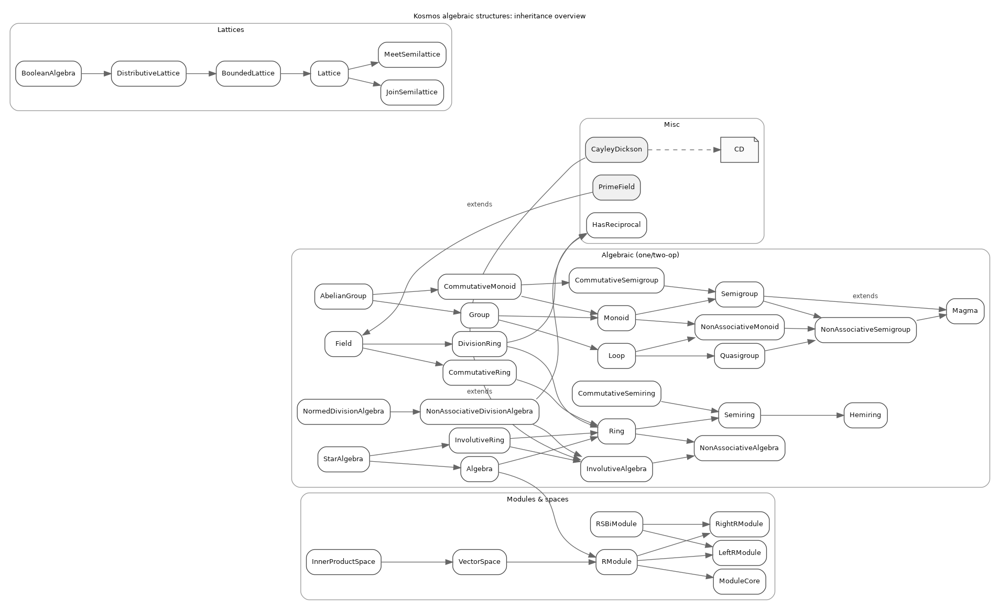

# Algebraic Structures

Here is a list of the algebraic structures currently supported by Kosmos and their
relationships:

```kotlin
interface AbelianGroup<A: Any> : Group<A>, CommutativeMonoid<A>
interface Algebra<R: Any, A: Any> : RModule<R, A>, Ring<A>
interface BooleanAlgebra<A: Any> : DistributiveLattice<A>
class CayleyDickson<A : Any>(private val base: InvolutiveAlgebra<A>) : InvolutiveAlgebra<CD<A>>
data class CD<A : Any>(val a: A, val b: A)
interface CommutativeMonoid<A: Any> : Monoid<A>, CommutativeSemigroup<A> 
interface CommutativeRing<A: Any> : Ring<A>
interface CommutativeSemigroup<A : Any> : Semigroup<A>
interface CommutativeSemiring<A: Any>: Semiring<A>
interface DivisionRing<A : Any> : Ring<A>, HasReciprocal<A>
interface Field<A : Any> : DivisionRing<A>, CommutativeRing<A>
interface Group<A : Any> : Monoid<A>, Loop<A>
interface HasReciprocal<A : Any>
interface Hemiring<A : Any>
interface InnerProductSpace<F : Any, V : Any> : VectorSpace<F, V>
interface InvolutiveAlgebra<A : Any> : NonAssociativeAlgebra<A>
interface InvolutiveRing<A : Any> : InvolutiveAlgebra<A>, Ring<A>
interface JoinSemilattice<A : Any>
interface MeetSemilattice<A : Any>
interface Lattice<A : Any> : JoinSemilattice<A>, MeetSemilattice<A>
interface BoundedLattice<A : Any> : Lattice<A>
interface DistributiveLattice<A : Any> : BoundedLattice<A>
interface Loop<A : Any> : Quasigroup<A>, NonAssociativeMonoid<A>
interface Magma<A: Any>
interface LeftRModule<R : Any, M : Any>
interface RightRModule<R : Any, M : Any>
interface RSBiModule<R : Any, S : Any, M : Any> : LeftRModule<R, M>, RightRModule<S, M>
interface ModuleCore<R : Any, M : Any>
interface RModule<R : Any, M : Any> : LeftRModule<R, M>, RightRModule<R, M>, ModuleCore<R, M>
interface Monoid<A : Any> : Semigroup<A>, NonAssociativeMonoid<A>
interface NonAssociativeAlgebra<A : Any>
interface NonAssociativeDivisionAlgebra<A : Any> : InvolutiveAlgebra<A>, HasReciprocal<A>
interface NonAssociativeMonoid<A : Any> : NonAssociativeSemigroup<A>
interface NonAssociativeSemigroup<A : Any> : Magma<A>
interface NormedDivisionAlgebra<A : Any>: NonAssociativeDivisionAlgebra<A>
data class PrimeField(val p: BigInteger) : Field<BigInteger>
interface Quasigroup<A: Any> : NonAssociativeSemigroup<A>
interface Ring<A : Any>: NonAssociativeAlgebra<A>, Semiring<A>
interface Semigroup<A : Any> : Magma<A>, NonAssociativeSemigroup<A>
interface Semiring<A : Any>: Hemiring<A>
interface StarAlgebra<R : Any, A : Any> : Algebra<R, A>, InvolutiveRing<A>
interface VectorSpace<F : Any, V : Any> : RModule<F, V>
```

This is captured by the following diagram:


To produce the graph and see the instructions, see:
- [gen_structures_dot.py](../../../../../../../../../tools/gen_structures_dot.py)
